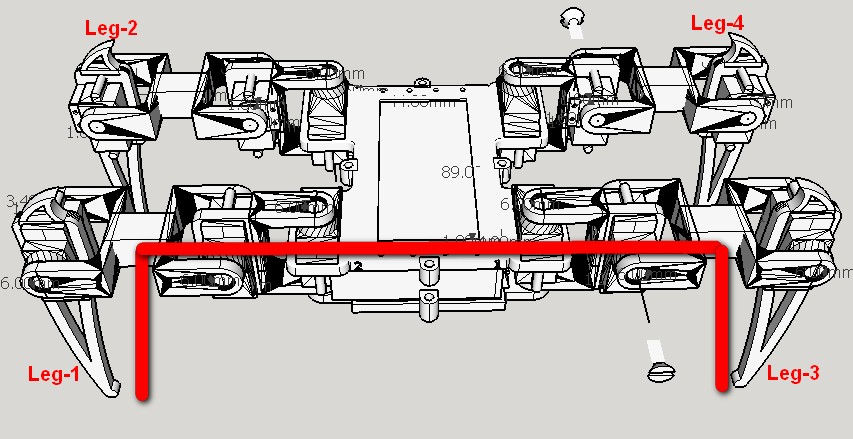

# Spider Robot Code

This repository contains the Spider Robot code for Arduino (plus some proof-of-concept code for Raspberry Pi in [rpi](rpi) folder.)

## Requirements

1. Arduino Uno
2. Arduino power supply or USB cable if powered over USB
3. Adafruit PCA9685 PWM driver
4. 5 V, 3500 mA power supply
5. HC-06 Bluetooth module
6. Spider Robot

## Wiring

Arduino and PCA9685 communicate using I2C.

| Arduino Uno | PCA9685 |
| ----------- | ------- |
| 5V          | VCC     |
| A4          | SDA     |
| A5          | SCL     |
| GND         | GND     |

| Arduino Uno | HC-06   |
| ----------- | ------- |
| 3.3V        | VCC     |
| GND         | GND     |
| TX          | RXD     |
| RX          | TXD     |

> Note: When uploading firmware with PC → USB → Arduino, disconnect HC-06 from Arduino board (TX and RX are sufficient). HC-06 interferes with the programming process otherwise.

Servos need a lot of power. To prevent the PWM driver from overload, PCA9685 has a dedicated power connector.

| 5 V, 3500 mA power supply | PCA9685 dedicated power connector |
| ------------------------- | --------------------------------- |
| +                         | V+                                |
| -                         | GND                               |

See _define servos' ports_ in [spider_robot_main_code.ino](spider_robot_main_code/spider_robot_main_code.ino), which servo to connect to which PCA9685 PWM port.

## Usage

### Servo Alignment

1. Unscrew and remove servo arms to make Spider Robot servos rotate freely.
2. Compile [Scaling_servos.ino](Scaling_servos/Scaling_servos.ino) and upload it to Arduino. It will move all servos to 90°.
3. Move each Spider Robot joint to the neutral position as shown on the picture:
   
4. Reattach servo arms with screws.

### Main Code

This code listens for commands over the Blueetooth and executes requested move.

Compile [spider_robot_main_code.ino](spider_robot_main_code/spider_robot_main_code.ino) and upload it to Arduino.
